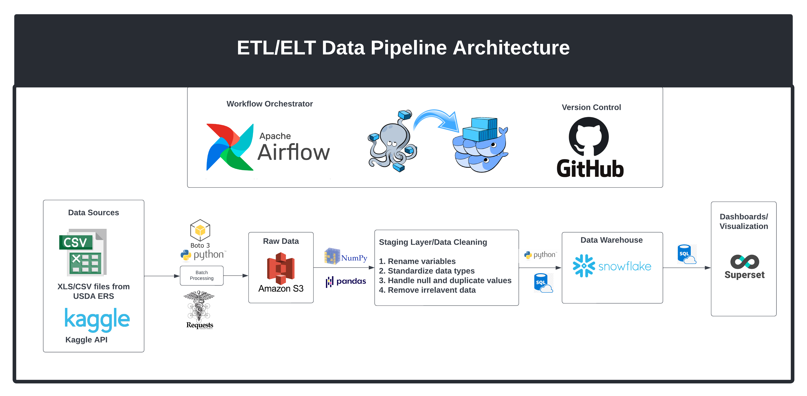
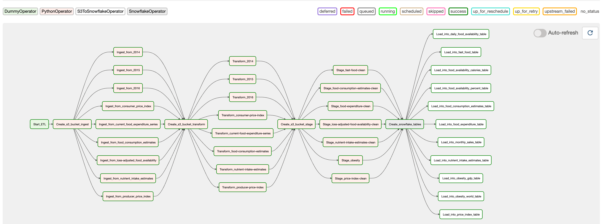
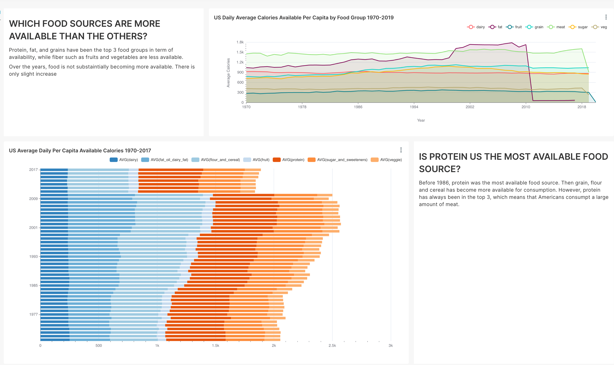
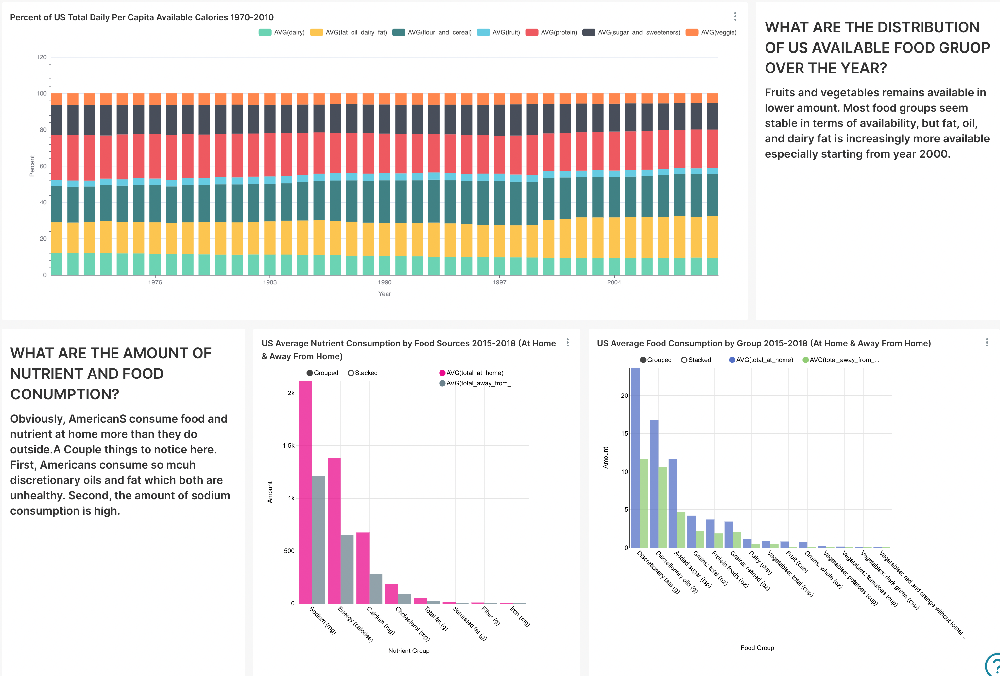
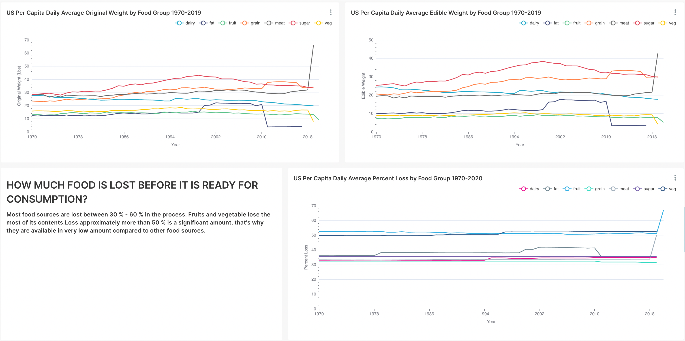
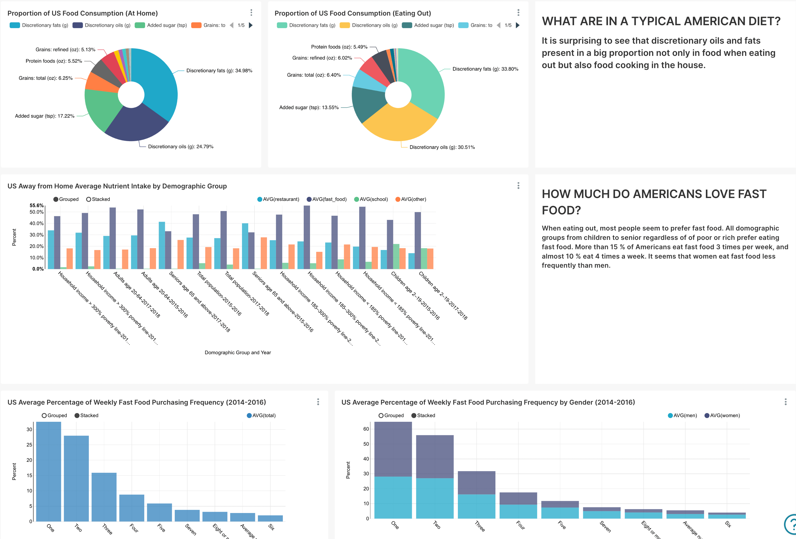
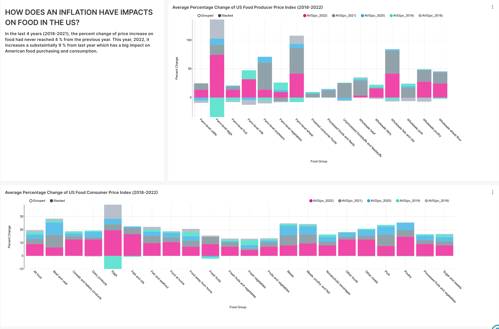
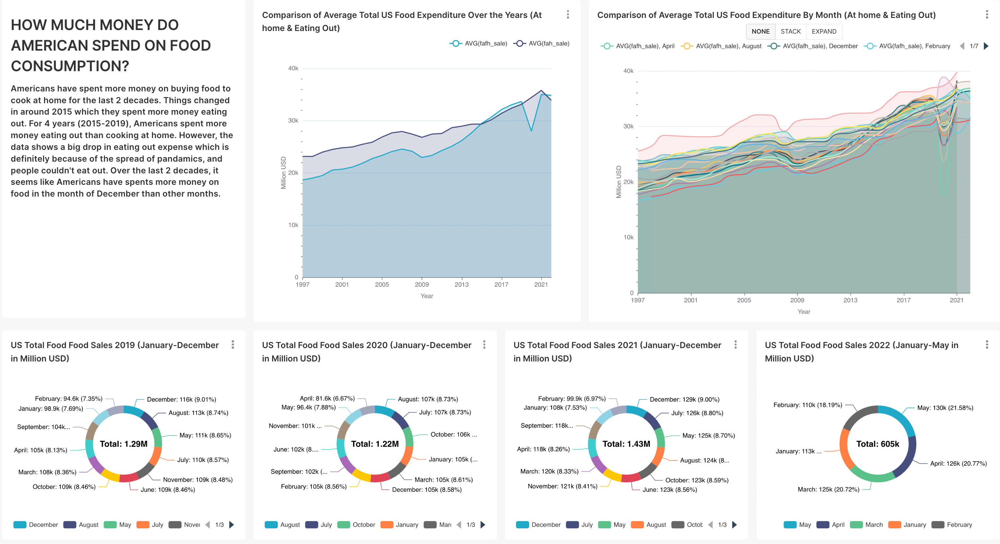
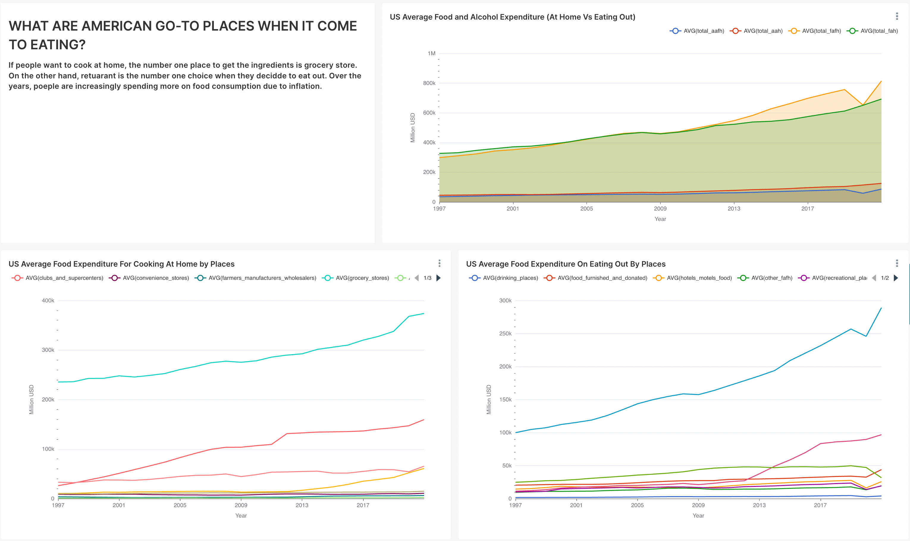
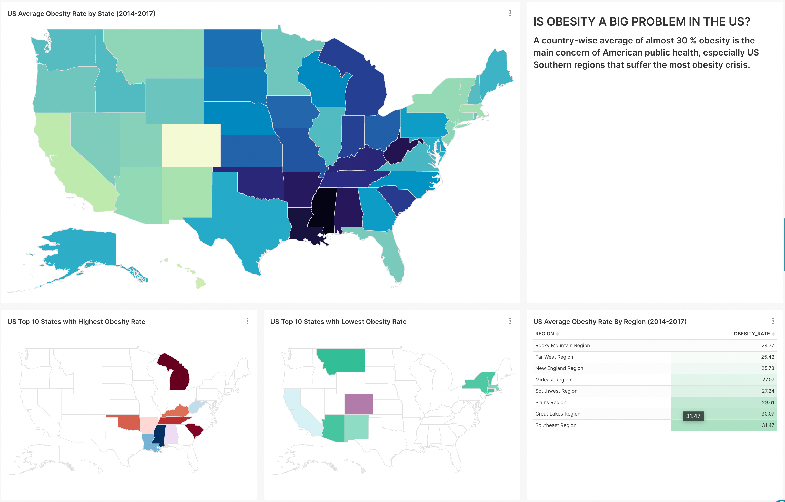

# PROJECT OVERVIEW
A data engineering project, specifically an automated data pipeline that weekly ingests US food 
and nutrition data from source systems to data lake S3. Then transform,
clean, stage, and load data into data warehouse, Snowflake. Finally, build dashboard in Superset.

## Development and Framework
Use Apache Airflow as pipeline ochestrator and run in container, Docker and Docker-compose.
Cloud-based storage and vizualization: AWS S3, Snowflake, and Preset (Superset).

## Data sources
#### US Department of Agriculture, Economic Research Service
- [US Food Availibility](https://www.ers.usda.gov/data-products/food-availability-per-capita-data-system/)
- [US Food Consumption and Nutrient Intakes](https://www.ers.usda.gov/data-products/food-consumption-and-nutrient-intakes/)
- [US Eating and Health Module](https://www.ers.usda.gov/data-products/eating-and-health-module-atus/)
- [US Food Price Outlook](https://www.ers.usda.gov/data-products/food-price-outlook/)
- [US Food Expenditure Series](https://www.ers.usda.gov/data-products/food-expenditure-series/)

#### Obesity Data (Kaggle) 
- [Obesity among adults by country, 1975 - 2016](https://www.kaggle.com/datasets/amanarora/obesity-among-adults-by-country-19752016)
- [Obesity and GDP US (2014-2017)](https://www.kaggle.com/datasets/annedunn/obesity-and-gdp-rates-from-50-states-in-20142017)
## To start Airflow:
```
docker build . --tag extending-airflow:lastest
docker-compose up airflow-init
docker-compose up -d --no-deps --build airflow-webserver airflow-scheduler
```
## To shutdown Airflow:
```
docker-compose down
```

## Tech Stack


## Airflow DAG


## Interactive Dashbord in Superset










